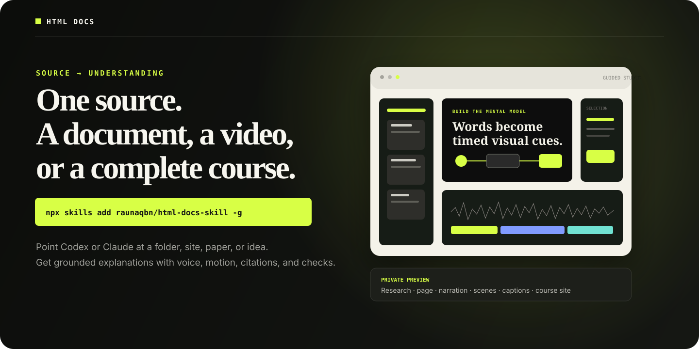
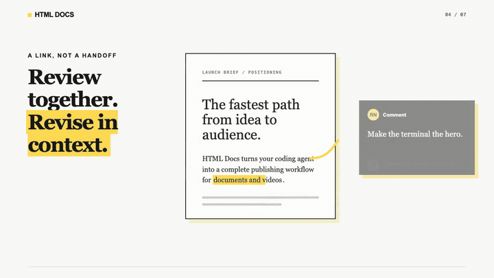
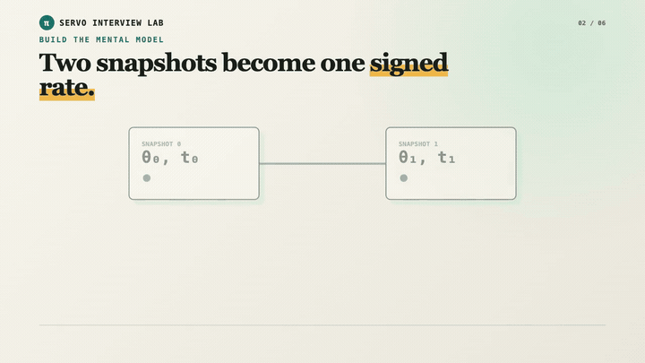
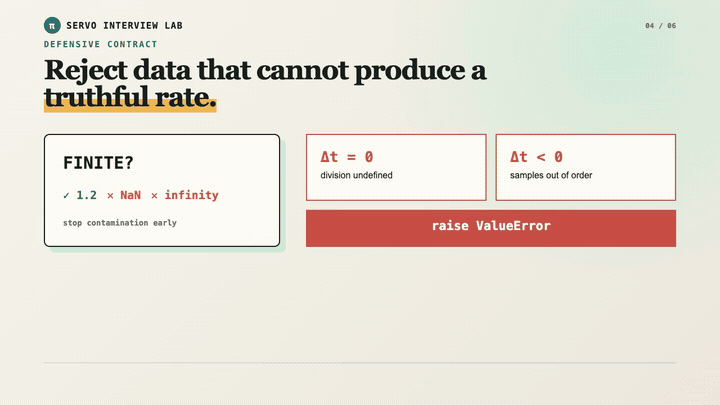

<div align="center">
  
</div>

<p align="center">
  <a href="https://www.npmjs.com/package/@html-docs/cli"></a>
  <a href="./LICENSE"></a>
  <a href="https://www.html-docs.com/showcase"></a>
  <a href="https://www.html-docs.com/agents"></a>
</p>

<h3 align="center">Point Codex or Claude at a folder, codebase, website, paper, PDF, document, or research topic.</h3>
<p align="center">Get a source-grounded HTML document, narrated explainer video, or complete learning course—with citations, captions, editable scenes, and a shareable site.</p>

## Install once

```bash
npx skills add raunaqbn/html-docs-skill --skill html-docs -g
```

Start a fresh Codex task or Claude Code session. Then ask in ordinary language:

```text
Use $html-docs to turn this codebase into a private course for new engineers.
```

No hosted authoring model is hidden behind the command. Your current agent
researches, writes, designs, and authors the project. The open local tools
normalize sources, compile scenes, synchronize narration, audit frames, render
media, and publish a private preview.

## Ask for the outcome you need

| Output | Prompt |
|---|---|
| **Document** | `Use $html-docs to research this topic and make a beautiful, cited visual document.` |
| **Video** | `Use $html-docs to turn this URL into a five-minute captioned explainer video.` |
| **Document + video** | `Use $html-docs to explain this paper with a rich page and embedded narrated video.` |
| **Complete course** | `Use $html-docs to turn this folder into a private course with lessons, videos, checks, and progress.` |
| **Auto** | `Use $html-docs to choose the clearest format for explaining this source.` |

Automatic runs stay private. Public or unlisted publication is a separate,
explicit action.

## Built with HTML, voice, and evidence

These lightweight loops are frames from real HTML Docs renderer output—not
product mockups.

<table>
  <tr>
    <td width="50%">
      
      <h3>Document + video</h3>
      <p>One agent authors the detailed page and the visual mental model. Review, revise, and share in the same context.</p>
    </td>
    <td width="50%">
      
      <h3>Explanatory motion</h3>
      <p>Final narration timings own scene boundaries, visual cues, captions, and settled states.</p>
    </td>
  </tr>
  <tr>
    <td colspan="2">
      
      <h3>Codebase → course</h3>
      <p>Source evidence becomes an architecture model, rich lesson page, code walkthrough, narrated video, transcript, and grounded checks.</p>
    </td>
  </tr>
</table>

Explore the live Player, course pages, source projects, and Studio artifacts in
the [HTML Docs showcase](https://www.html-docs.com/showcase).

Reproduction briefs and portable source ledgers live in
[`examples/`](./examples): codebase → course, website → document + video, and
research topic → course.

## The production loop

```text
folder · repo · URL · PDF · document · topic
                      │
                      ▼
          source snapshot + evidence graph
                      │
                      ▼
        course map · lesson model · design system
                      │
           ┌──────────┴──────────┐
           ▼                     ▼
    rich HTML page        locked narration
                                 │
                                 ▼
                     timed words + visual cues
                                 │
                                 ▼
                  deterministic HTML scene modules
                                 │
                                 ▼
                  audit · Player · Studio · MP4
```

The page and video share one evidence model but serve different jobs: the page
is the detailed reference; the video teaches the core mechanism visually.

## Why the synchronization holds

- Generate or record final audio before final scene timing.
- Prefer provider-native word timestamps.
- Forced-align the locked transcript when timestamps are unavailable.
- Assign every spoken word to exactly one cue and scene.
- Give every cue one or more same-scene `data-html-video-id` targets.
- Derive captions, chapters, scenes, and visual timing from the same word track.
- Seek Chromium to explicit timestamps; never depend on wall clocks or
  self-running animation.
- Compare repeated same-time captures and inspect cue/scene contact sheets.

Voice profiles are provider-neutral: `warm-teacher`, `gentle-guide`,
`precise-engineer`, and `energetic-coach`. ElevenLabs is supported through
bring-your-own-key; Kokoro is the offline fallback. Provider keys stay local.

## The open product

| Package | Responsibility |
|---|---|
| [`html-docs/`](./html-docs) | Installable agent skill, source/research workflow, document design system, video direction, and course production |
| [`@html-docs/cli`](./bin/cli.js) | Publishing, authentication, MCP server, project orchestration, and agent installation |
| [`@html-docs/html-video`](./packages/html-video) | Portable project schemas, source snapshots, audio/caption timing, deterministic runtime, audits, Chromium capture, FFmpeg rendering, and sync |
| [`@html-docs/player`](./packages/player) | Dependency-free `<html-docs-video>` web component with live-player and MP4 fallback |
| [`@html-docs/studio`](./packages/studio) | Evidence-aware educational Studio with live preview, waveform, cue/caption lanes, semantic selection, overrides, requests, and versions |

Authored source, rendering, voice generation, and provider credentials stay on
your machine. HTML Docs hosts private project versions, collaborative pages,
the live Player, Guided Studio, course sites, and explicitly published media.

## Local project commands

The skill invokes these for you, but every stage is inspectable:

```bash
# Any source, with an explicit or automatic output mode
html-docs project init ./source --mode auto --output ./explanation
html-docs project build ./explanation
html-docs project audit ./explanation
html-docs project preview ./explanation

# A video
html-docs/scripts/video.sh build ./video-project
html-docs/scripts/video.sh check ./video-project
html-docs/scripts/video.sh audit ./video-project
html-docs/scripts/video.sh render ./video-project --output ./final.mp4

# A course
html-docs/scripts/video.sh course init ./source \
  --output ./course-project --title "Course title"
html-docs/scripts/video.sh course build ./course-project
html-docs/scripts/video.sh course audit ./course-project
html-docs/scripts/video.sh course preview ./course-project
html-docs/scripts/video.sh course publish ./course-project
```

Renderer frame caches are content-addressed. If Chromium or FFmpeg is
interrupted, rerunning the render reuses every completed deterministic frame.

The scaffold is only a normalized starting point. The active agent replaces it
with the evidence graph, curriculum, lesson pages, narration, storyboards,
semantic scenes, captions, and checks.

## Publish any HTML

The document-only path stays one command:

```bash
npx @html-docs/cli publish page.html
# → https://www.html-docs.com/site/<slug>
```

Authenticate owned work:

```bash
npx @html-docs/cli auth
```

Install the MCP server in detected clients:

```bash
npx @html-docs/cli install
```

Available tools include document publishing, reading, updating, commenting,
video synchronization, and project operations. See the
[agent guide](https://www.html-docs.com/agents) and
[API reference](https://www.html-docs.com/developers).

## Portable artifacts

Courses and videos are ordinary folders with JSON manifests, Markdown briefs,
HTML/CSS/JavaScript scene modules, audio files, timed words, captions, evidence
records, quality reports, and rendered fallbacks. They can be inspected,
versioned, moved, rendered locally, or hosted independently.

## License and provenance

The HTML Docs skill, Producer, Player, and Studio are MIT licensed. Third-party
dependencies and adapted design references are recorded in
[`NOTICE`](./html-docs/references/NOTICE). See [`PROVENANCE.md`](./PROVENANCE.md)
and [`THIRD_PARTY_NOTICES.md`](./THIRD_PARTY_NOTICES.md) for release provenance.
